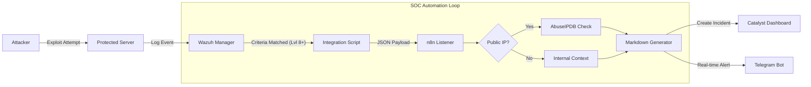

# 🌐 NexusSOAR – Automated Incident Response Orchestration

```text
    _   __                     _____ ____  ___    ____ 
   / | / /__  _  ____  _______/ ___// __ \/   |  / __ \
  /  |/ / _ \| |/_/ / / / ___/\__ \/ / / / /| | / /_/ /
 / /|  /  __/>  </ /_/ (__  )___/ / /_/ / ___ |/ _, _/ 
/_/ |_/\___/_/|_|\__,_/____//____/\____/_/  |_/_/ |_|  
```

> **"The Central Hub of Automated Defense."**

[](LICENSE)
[](https://ubuntu.com/)
[](#-author-information)

---

## 📖 Executive Summary

**NexusSOAR** is a production-grade "SOC-in-a-Box" platform designed to democratize advanced security monitoring.

By fusing **Wazuh's** detection capabilities with **n8n's** limitless automation potential, **NexusSOAR** eliminates alert fatigue. It doesn't just tell you something is wrong—it analyzes the threat, creates a ticket, and notifies your team instantly.

**Why this exists:** To bridge the gap between detection (SIEM) and action (Response) without the complexity of enterprise tools.

---

## 🏗️ Core Technology Stack

The system is built on four pillars of modern security/ops:

| Component | Function | Why It Matters |
| :--- | :--- | :--- |
| **Wazuh** | **👀 The Eyes** | A powerful SIEM that scans logs, file integrity, and vulnerabilities in real-time. |
| **n8n** | **🧠 The Brain** | A workflow automation engine that decides *what to do* with an alert. |
| **Catalyst** | **📂 The Memory** | A specialized ticketing system to track incidents from open to close. |
| **Docker** | **📦 The Container** | Ensures the automation engine runs anywhere, isolation guaranteed. |

---

## 🔄 Architecture & Data Flow

Understanding how an alert travels from a hacker's packet to your phone:



---

## 🚀 Installation & Usage Guide

Follow these simple commands to deploy your SOC.

### 1️⃣ Prerequisites
*   OS: **Ubuntu 20.04+** or **Debian 11+**
*   Root Access: `sudo` privileges are required.
*   Resources: **8GB RAM** / **4 CPU** recommended.

### 2️⃣ Deployment
Log into your server and run the following block. This script handles all dependency hell for you.

```bash
# Clone the repository
git clone https://github.com/your-username/soar.git
cd soar

# Grant execution permissions
chmod +x deploy_soc.sh

# Launch the auto-installer
sudo ./deploy_soc.sh
```

> **☕ Grab a coffee.** The script will now install Docker, configure Wazuh, set up systemd services, and deploy containers. This takes about **5-10 minutes**.

### 3️⃣ Post-Install Configuration
Once the script finishes, you will see a summary screen. Access your tools here:

*   **🛡️ Wazuh Dashboard**: `https://<YOUR_SERVER_IP>`
*   **🎫 Catalyst Tickets**: `http://<YOUR_SERVER_IP>:8090`
    *   *Default User:* `admin@catalyst.local`
    *   *Default Pass:* `admin123` (**Change Immediately!**)
*   **⚙️ n8n Automation**: `http://<YOUR_SERVER_IP>:5678`

### 4️⃣ Activate the Workflow
1.  Open **n8n** in your browser.
2.  Click on the **"V10 SOC Edition"** workflow.
3.  Double-click the **AbuseIPDB** node → Paste your API Key.
4.  Double-click the **Telegram** nodes → Paste your Chat ID.
5.  Toggle the **Active** switch in the top right corner.

---

## 🌟 Key Benefits

*   **⚡ Instant Visibility**: Reduces "Time to Detect" (TTD) from hours to milliseconds.
*   **📉 Noise Reduction**: Intelligently filters out false positives using threat intel.
*   **💼 Professional Reporting**: Generates beautiful, compliant-ready tickets automatically.
*   **📱 Mobile First**: Manage basic incident awareness directly from Telegram.

---

## 📸 Screenshots

| **Wazuh Dashboard** | **n8n Workflow** |
|:---:|:---:|
|  |  |

| **Catalyst Dashboard** | **Tickets & Alerts** |
|:---:|:---:|
|  |  |

> *Experience the power of visualization and real-time alerts.*

---

## 🤝 Open Source Credits

This project stands on the shoulders of giants:
*   **[Wazuh](https://wazuh.com/)**: For the world's best open-source SIEM.
*   **[n8n](https://n8n.io/)**: For making automation accessible to everyone.
*   **[SecurityBrew](https://github.com/SecurityBrewIO)**: For the Catalyst ticketing engine.

---

## 👤 Author Information

<div align="center">

### **Kolluru Sai Abhiram**
🎓 **B.Tech CSE (Cybersecurity)** | **VIT-AP University** | **Class of 2027**

*"Automating the future of cyber defense, one script at a time."*

</div>

---

## ⚖️ License & Disclaimer

**MIT License** - Free to use, modify, and distribute.

> **⚠️ WARNING & LIABILITY DISCLAIMER**
>
> This tool is a powerful security instrument intended strictly for **educational usage** and **authorized defensive implementation**.
>
> 1.  **Do not** deploy this on networks you do not own.
> 2.  **Do not** use the automation logic for offensive purposes.
>
> The author, **Kolluru Sai Abhiram**, assumes **NO RESPONSIBILITY** for any misuse, damage, or legal consequences resulting from the deployment or modification of this code. By using this software, you agree to hold the author harmless from any and all liabilities. **Use responsibly.**

---
